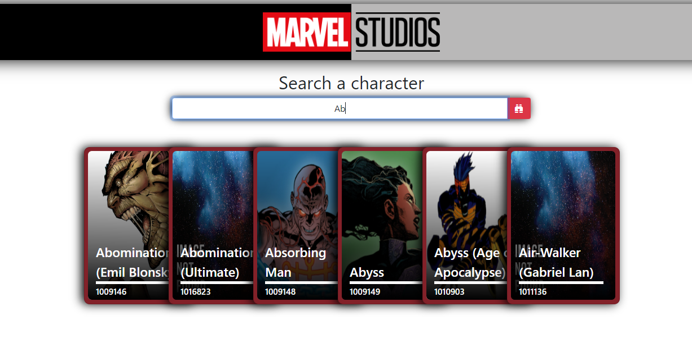
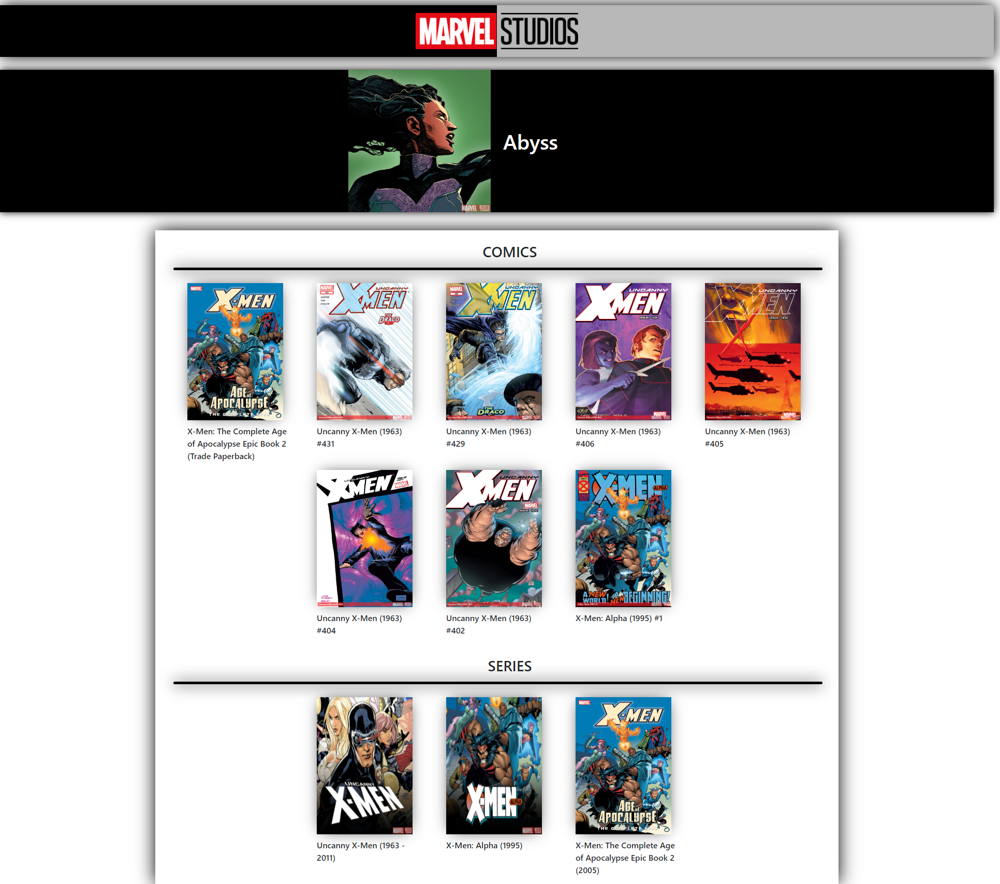

# Dev.f - Marvel Comics API

This is a solution to the project ✨ Marvel Comics ✨ of the [Kata JavaScript Avanzado](https://www.devf.la/master/encoding/mx).\
[Dev.f](https://www.devf.la/) offers an innovative solution to educational inclusion with EdTech programs that help people become software developers and obtain technological skills in order to obtain high-quality job opportunities in an agile and accessible way. 

## Table of contents

- [Overview](#overview)
  - [The challenge](#the-challenge)
  - [Marvel Comics API](#marvel-comics-api)
  - [How to interact (website)](#how-to-interact-with-he-website)
  - [Screenshot](#screenshot)
  - [Links](#links)
- [My process](#my-process)
  - [Built with](#built-with)
  - [Skills](#skills)
- [Author](#author)

## Overview

### The challenge

1. Create a website where you can consult the characters (by name or id) provided by the Marvel Comics API (20 characters)
2. Read information about each caracter that are displayed.

Such as:
- Name
- Id

3. Clicking on a character card displays the character's appearance in comics and series with the next information:
    - Image
    - Title

### Marvel Comics API

- [Home page](https://developer.marvel.com/)
- [Documentation](https://developer.marvel.com/documentation/getting_started)
- [Test Calls](https://developer.marvel.com/docs)

### How to interact with he website

1. At first, displayed on the page you can see a section with the logo of Marvel Studios, a searcher and also the full list of characters (20) provided by the API.

2. By clicking on the logo of Marvel Studios of the first section, you will be able to reload the website.

3. By typing on the searcher input you will be able to search characters by name or id.

4. By clicking on a character card you will be able to continue visualizing the first section (logo), but the searcher and the characters cards will be replaced by the following sections:

    1. Character: a black rectangule with an image and the name of the selected character
    2. Comics: A full list of comics where the selected character has made an appareance
    3. Series: A full list of series where the selected character has made an appareance

### Screenshot

1. **Entering the page**

2. **Searching characters**

3. **Clicking on a character card**

### Links

- GitHub Repository: [marvel-comics-api-github](https://github.com/Alelsito/marvel-comics-api)
- Live Site URL(Netlify): [marvel-comics-consuming-api-netlify](https://marvel-comics-consuming-api.netlify.app/)

## My process

### Built with

- HTML
- JS
- CSS
- [Bootstrap](https://getbootstrap.com/) - For styles
- [Bootstrap icons](https://icons.getbootstrap.com/) - For icons

### Skills

- APIs
- [NodeJS](https://nodejs.org/en/)
- [npm](https://www.npmjs.com/)
- [Node Fetch](https://www.npmjs.com/package/node-fetch)
- Handling forms and events
- Arrays Methods:
    * [filter()](https://developer.mozilla.org/es/docs/Web/JavaScript/Reference/Global_Objects/Array/filter)
    * [includes()](https://developer.mozilla.org/es/docs/Web/JavaScript/Reference/Global_Objects/Array/includes)

## Author

- Github - [@Alelsito](https://github.com/Alelsito)
